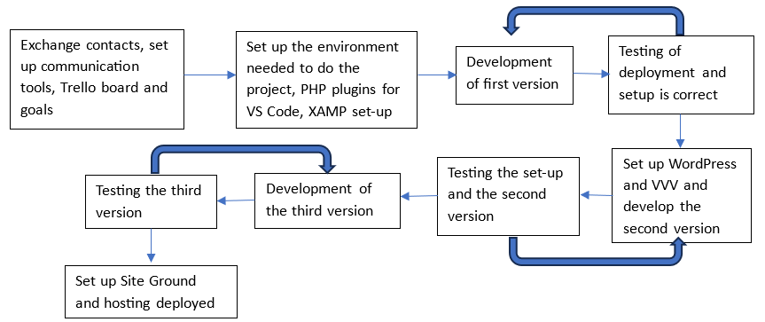

## deployment.md

### Development and Deployment Workflow

#### Project Management
- **Tools Used**: Trello
- **Team Roles**:
  - **Project Manager**: [Jiayi Li]
  - **Lead Developer**: [Zhenqi Ma]
  - **Content Design Team**: [Weiyu Zhu, Peipei Li]
  - **Development Team**: [Haolun Zhang, ]
  
- **Milestones**:
  - Project Kickoff: 07/24
  - Initial Design Draft: 07/24
  - Theme Development: 07/26
  - Testing Phase: 07/29 - 07/30
  - Deployment: 07/29

#### Version Control
- **Repository**: [[GitHub Repository URL](https://github.com/cp3402-students/project-cp3402-group4d)]
- **Branching Strategy**: 
  - **Main Branch**: `main`
- **Commit Message Guidelines**: 
  - No specific guidelines followed

#### Local Development Setup
- **Prerequisites**:
  - VirtualBox
  - Vagrant
  - VVV (Varying Vagrant Vagrants)
- **Setup Instructions**:
  1. Install VirtualBox and Vagrant.
  2. Clone the VVV repository: `git clone https://github.com/Varying-Vagrant-Vagrants/VVV.git`
  3. Navigate to the VVV directory: `cd VVV`
  4. Run VVV to set up the environment: `vagrant up`
  5. Configure WordPress on the hosts.
  6. Clone the project repository: `git clone [repository URL]`
  7. Navigate to the project directory: `cd [project-directory]`

#### Testing
- **Testing Tools**: No specific testing tools used
- **Testing Procedure**: Manual testing by team members

#### Deployment Workflow
- **Deployment Steps**:
  1. Complete the final development phase.
  2. Package the theme into a zip file.
  3. Manually upload the theme to AWS Lightsail.
  4. Test the theme to ensure it runs correctly.
  5. Continue with the web content construction.

#### Automation
- No automation implemented

### Security and Backup
- **Security Measures**:
  - Basic security configurations of the hosting provider
- **Backup Strategy**:
  - No formal backup strategy implemented

### Enhancements

- **Project Workflow Image**: 
  

- **Code Block for Local Setup**:
  ```bash
  git clone https://github.com/Varying-Vagrant-Vagrants/VVV.git
  cd VVV
  vagrant up
  git clone [repository URL]
  cd [project-directory]
